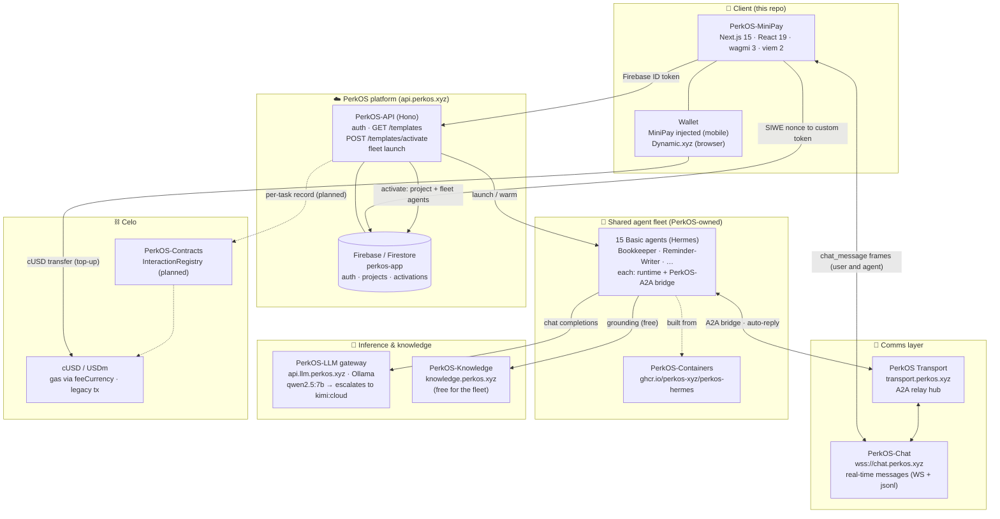

# Anna by PerkOS

**Everyday business help, inside your wallet.** Anna helps non-technical small-business owners improve
messages, reply to customers, prepare social posts, translate, summarize, and organize routine work. It runs
on **Celo** and is delivered as a Mini App inside **Opera MiniPay**.

This repository contains the Celo/MiniPay surface of [PerkOS](https://app.perkos.xyz). In the product, Anna
is the single customer-facing identity. A user can start with one of six direct actions or choose a work
profile for a shop, restaurant, service business, social seller, or secretary. The shared specialist fleet
remains an internal implementation detail.

> Full research + the shared-agents design: [`docs/PERKOS-MINIPAY-RESEARCH.md`](docs/PERKOS-MINIPAY-RESEARCH.md).

## How it works — simple actions and work profiles

The Home screen starts with six direct actions that need no prompt-writing knowledge:

- Fix this text
- Reply to a customer
- Create a post
- Change the tone
- Translate naturally
- Summarize notes

Eight optional profiles cover everyday writing, customer messages, social posts, secretary work, shops,
restaurants, service businesses, and social sellers. The public catalog deliberately excludes debt
collection, loans, rent collection, yield, and money-movement templates. Existing legacy projects continue
to work, but retired profiles cannot be newly discovered or activated.

## Architecture — the PerkOS components MiniPay talks to



### Component roles

| PerkOS component | URL / where | MiniPay uses it for |
|---|---|---|
| **PerkOS-API** | `api.perkos.xyz` | Wallet sign-in, quick writing actions, profile discovery/activation, fleet launch |
| **Firebase / Firestore** | project `perkos-app` | Auth (custom token), projects, activations, conversation metadata |
| **PerkOS-Chat** | `wss://chat.perkos.xyz` | Real-time chat — user ↔ agent messages stream here (never stored in Firestore) |
| **PerkOS Transport** | `transport.perkos.xyz` | A2A relay hub the agent bridges connect to |
| **PerkOS-A2A** | per-agent bridge | Bridges each fleet agent to the relay + chat; auto-replies the runtime's answer |
| **Shared fleet** | PerkOS-owned host | 15 Hermes "basic" agents, shared across all users |
| **PerkOS-Containers** | `ghcr.io/perkos-xyz` | The Hermes runtime image the fleet runs |
| **PerkOS-LLM** | `api.llm.perkos.xyz` | Ollama gateway — `qwen2.5:7b` for simple tasks, auto-escalates to `kimi-k2.6:cloud` |
| **PerkOS-Knowledge** | `knowledge.perkos.xyz` | Knowledge base the agents query (free for the fleet wallet) |
| **Celo** | mainnet | MiniPay-native cUSD/USDT/USDC payments (gas in cUSD via fee abstraction, legacy tx) |
| **Base** | mainnet | Browser credit packs and memberships paid with native USDC through gas-sponsored x402 settlement |
| **Robinhood Chain** | mainnet | Browser credit packs and memberships paid with canonical USDG through gas-sponsored x402 settlement |
| **PerkOS-Contracts** | Celo | `InteractionRegistry` for on-chain usage records (planned) |
| **Dynamic.xyz** | browser only | Wallet login in a regular browser (bridgeless; same env as PerkOS App) |

## MiniPay rules baked into the code

| Rule | Where it lives |
|------|----------------|
| Implicit connection — no "Connect Wallet" button in MiniPay | [`app/components/AutoConnect.tsx`](app/components/AutoConnect.tsx) |
| Detect MiniPay via `window.ethereum.isMiniPay` | [`app/lib/useIsMiniPay.ts`](app/lib/useIsMiniPay.ts) |
| MiniPay fixed to Celo; browser supports Celo, Base, and Robinhood Chain | [`app/lib/wagmi.ts`](app/lib/wagmi.ts), [`app/lib/browserChains.ts`](app/lib/browserChains.ts) |
| Stablecoins + decimals (cUSD=18, USDC/USDT=6) | [`app/lib/tokenAddresses.ts`](app/lib/tokenAddresses.ts) |
| Gas in cUSD (`feeCurrency`) + legacy tx only | [`app/lib/celo.ts`](app/lib/celo.ts) |
| Browser wallet via Dynamic (bridgeless, wagmi v3) | [`app/components/DynamicProviders.tsx`](app/components/DynamicProviders.tsx) |
| Browser-only chain selector; hidden inside MiniPay | [`app/components/BrowserChainSelect.tsx`](app/components/BrowserChainSelect.tsx) |
| Browser payments: Base USDC + Robinhood USDG via signed EIP-3009/x402 authorizations | [`app/lib/paymentRails.ts`](app/lib/paymentRails.ts), [`app/lib/x402Payment.ts`](app/lib/x402Payment.ts) |
| Browser language detection + EN/ES/PT selector | [`app/lib/landingMessages.ts`](app/lib/landingMessages.ts), [`app/components/LanguageSelect.tsx`](app/components/LanguageSelect.tsx) |
| Real-time chat over PerkOS-Chat (WS) | [`app/lib/chatClient.ts`](app/lib/chatClient.ts), [`app/lib/useChatConversation.ts`](app/lib/useChatConversation.ts) |
| Six direct actions + eight everyday work profiles | [`app/lib/starterChores.ts`](app/lib/starterChores.ts), [`app/lib/templateCatalogData.ts`](app/lib/templateCatalogData.ts) |

## Tech stack

Next.js 15 (App Router) · React 19 · wagmi 3 · viem 2 · TanStack Query · Tailwind v4 · Firebase · Dynamic.xyz.

## Develop

```bash
npm install
npm run dev          # http://localhost:3000
npm run typecheck
npm run build
```

The development-only `/e2e` route renders the direct-action interface with a deterministic local result.
It supports browser UI testing without a wallet or paid LLM call and returns 404 in production builds.

### Test inside MiniPay

You cannot use an emulator. On a real Android/iOS device with MiniPay:

1. Expose your dev server: `ngrok http 3000`.
2. MiniPay → Settings → About → tap the version repeatedly → **Developer Settings** → **Site Tester**.
3. Paste the ngrok URL. Toggle **Use Testnet** for Celo Sepolia; fund via [faucet.celo.org](https://faucet.celo.org).

## Branch workflow

`main` is the baseline. All work happens on feature branches → PR → `main`.
Commits are authored by **JulioMCruz** (no `Co-Authored-By` trailers), per the PerkOS convention.
