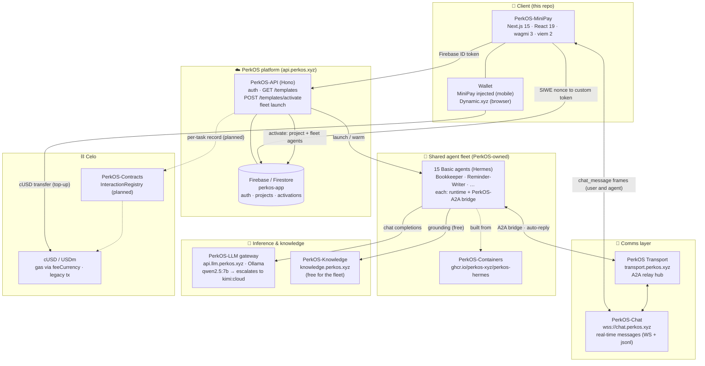

# PerkOS-MiniPay

**Money & customer tools for your business — inside your wallet.** A gallery of AI helpers built on **Celo**
and delivered as a Mini App inside **Opera MiniPay**. Pay only for the work, in **cUSD**.

This is the Celo/MiniPay surface of [PerkOS](https://app.perkos.xyz). A small-business owner picks a **tool**
(Merchant Daily, Savings Group, Freelance Invoices, Rent Tracker, …), and it activates instantly on a shared
fleet of **PerkOS-owned agents** — no deployment, no waiting. The user just chats with their helpers.

> Full research + the shared-agents design: [`docs/PERKOS-MINIPAY-RESEARCH.md`](docs/PERKOS-MINIPAY-RESEARCH.md).

## How it works — 15 basics composed by 20 templates

MiniPay does **not** make each user deploy agents. PerkOS runs a small fleet of **15 reusable "basic" agents**
(Bookkeeper, Debt-Tracker, Reminder-Writer, Invoice-Maker, Group-Ledger, Rotation-Coordinator,
Payment-Scheduler, Remittance-Tracker, Summary-Reporter, Expense-Splitter, Goal-Coach, Money-Explainer,
Customer-Replies, Assistant, Topup-Tracker). Each **template** is a curated composition of a few basics:

- **Merchant Daily** = Bookkeeper + Customer-Replies + Summary-Reporter
- **Freelance Invoices** = Invoice-Maker + Reminder-Writer
- **Savings Group (Ajo/ROSCA)** = Rotation-Coordinator + Group-Ledger
- **Rent Tracker** = Payment-Scheduler + Reminder-Writer

Activating a template creates the user's project pointing at those shared basics (instant). Cost is amortized
across all users; the fleet is nearly free at idle. All agents are **non-custodial** — they track, remind,
draft, and prepare; the owner makes every payment themselves in MiniPay.

## Architecture — the PerkOS components MiniPay talks to



### Component roles

| PerkOS component | URL / where | MiniPay uses it for |
|---|---|---|
| **PerkOS-API** | `api.perkos.xyz` | Wallet sign-in, `GET /templates`, `POST /templates/activate`, fleet launch |
| **Firebase / Firestore** | project `perkos-app` | Auth (custom token), projects, activations, conversation metadata |
| **PerkOS-Chat** | `wss://chat.perkos.xyz` | Real-time chat — user ↔ agent messages stream here (never stored in Firestore) |
| **PerkOS Transport** | `transport.perkos.xyz` | A2A relay hub the agent bridges connect to |
| **PerkOS-A2A** | per-agent bridge | Bridges each fleet agent to the relay + chat; auto-replies the runtime's answer |
| **Shared fleet** | PerkOS-owned host | 15 Hermes "basic" agents, shared across all users |
| **PerkOS-Containers** | `ghcr.io/perkos-xyz` | The Hermes runtime image the fleet runs |
| **PerkOS-LLM** | `api.llm.perkos.xyz` | Ollama gateway — `qwen2.5:7b` for simple tasks, auto-escalates to `kimi-k2.6:cloud` |
| **PerkOS-Knowledge** | `knowledge.perkos.xyz` | Knowledge base the agents query (free for the fleet wallet) |
| **Celo** | mainnet | cUSD payments (gas in cUSD via fee abstraction, legacy tx) |
| **PerkOS-Contracts** | Celo | `InteractionRegistry` for on-chain usage records (planned) |
| **Dynamic.xyz** | browser only | Wallet login in a regular browser (bridgeless; same env as PerkOS App) |

## MiniPay rules baked into the code

| Rule | Where it lives |
|------|----------------|
| Implicit connection — no "Connect Wallet" button in MiniPay | [`app/components/AutoConnect.tsx`](app/components/AutoConnect.tsx) |
| Detect MiniPay via `window.ethereum.isMiniPay` | [`app/lib/useIsMiniPay.ts`](app/lib/useIsMiniPay.ts) |
| Celo-only chains + injected connector | [`app/lib/wagmi.ts`](app/lib/wagmi.ts) |
| Stablecoins + decimals (cUSD=18, USDC/USDT=6) | [`app/lib/tokenAddresses.ts`](app/lib/tokenAddresses.ts) |
| Gas in cUSD (`feeCurrency`) + legacy tx only | [`app/lib/celo.ts`](app/lib/celo.ts) |
| Browser wallet via Dynamic (bridgeless, wagmi v3) | [`app/components/DynamicProviders.tsx`](app/components/DynamicProviders.tsx) |
| Real-time chat over PerkOS-Chat (WS) | [`app/lib/chatClient.ts`](app/lib/chatClient.ts), [`app/lib/useChatConversation.ts`](app/lib/useChatConversation.ts) |
| Template catalog (15 basics × 20 templates) | [`app/lib/templateCatalog.ts`](app/lib/templateCatalog.ts) |

## Tech stack

Next.js 15 (App Router) · React 19 · wagmi 3 · viem 2 · TanStack Query · Tailwind v4 · Firebase · Dynamic.xyz.

## Develop

```bash
npm install
npm run dev          # http://localhost:3000
npm run typecheck
npm run build
```

### Test inside MiniPay

You cannot use an emulator. On a real Android/iOS device with MiniPay:

1. Expose your dev server: `ngrok http 3000`.
2. MiniPay → Settings → About → tap the version repeatedly → **Developer Settings** → **Site Tester**.
3. Paste the ngrok URL. Toggle **Use Testnet** for Celo Sepolia; fund via [faucet.celo.org](https://faucet.celo.org).

## Branch workflow

`main` is the baseline. All work happens on feature branches → PR → `main`.
Commits are authored by **JulioMCruz** (no `Co-Authored-By` trailers), per the PerkOS convention.
